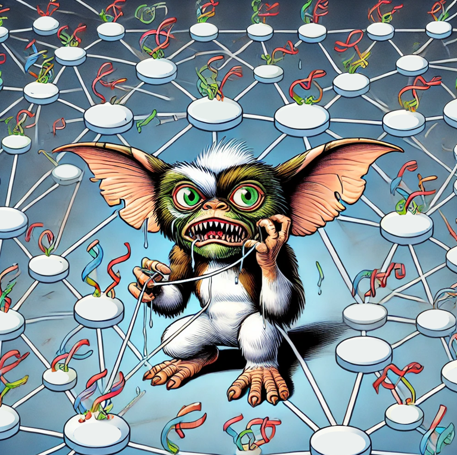

# GReNMlin

GReNMlin (Gene Regulatory Network Modeling) is a package for constructing and simulating models of gene regulatory networks. Its main modules are:

* [`grn.py`](grn.py): supports building and modifactions of gene regulatory network models.
* [`simulator.py`](simulator.py): supports different types of simulations of models build with [`grn.py`](grn.py).
* [`helpers.py`](helpers.py): helper functions.

Demonstrative examples are provided in [`examples.ipynb`](examples.ipynb).

